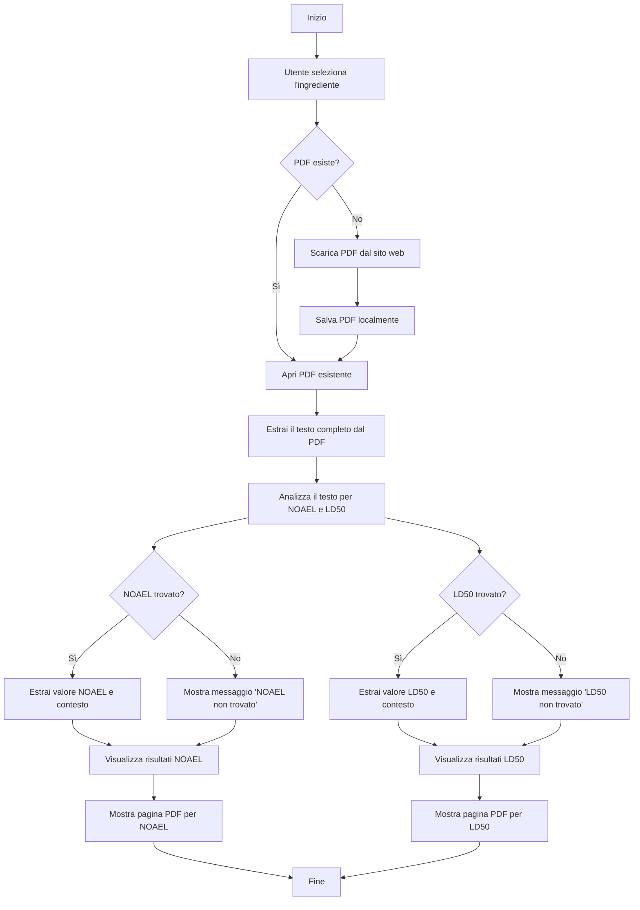

# Analizzatore di Ingredienti

L'Analizzatore di Ingredienti è un'applicazione web basata su Streamlit che permette agli utenti di analizzare ingredienti chimici, estraendo e visualizzando i valori NOAEL (No Observed Adverse Effect Level) e LD50 (Dose Letale, 50%) dai rapporti di sicurezza CIR (Cosmetic Ingredient Review).

## Funzionalità

- Ricerca e selezione degli ingredienti da un database;
- Recupero e analisi automatica dei rapporti di sicurezza in PDF;
- Estrazione e visualizzazione dei valori NOAEL e LD50;
- Visualizzazione delle frasi di contesto per i valori estratti;
- Visualizzazione delle pagine PDF rilevanti per la verifica;
- Filtraggio degli ingredienti per lettera o numero(!);
- Aggiornamento del database degli ingredienti dal sito web CIR;

## Requisiti
- Dipendenze elencate in `requirements.txt`;
- Consigliato fortemente la creazione e l'uso di un .venv;

## Installazione

1. Clona il repository:
   ```
   git clone https://github.com/TedescoAndrea/Project-work 
   cd Project-work
   ```

2. Installa i pacchetti richiesti:
   ```
   pip install -r requirements.txt
   ```

3. Scarica il modello linguistico inglese di spaCy:
   ```
   python -m spacy download en_core_web_sm
   ```

4. Assicurati di avere il file `SCRAPER_DEF.py` con la funzione `miao` per l'aggiornamento del database.

5. Posiziona il file iniziale `cir_reports.xlsx` nella directory del progetto. Attenzione: nel caso non ci fosse il file `cir_reports.xlsx`, quando eseguirete l'applicazione dovrete avviare un aggiornamento del database. 

## Utilizzo

1. Avvia l'applicazione Streamlit:
   ```
   streamlit run gui.py
   ```

2. Apri il browser web e naviga all'URL locale fornito (solitamente `http://localhost:8501`). Generalmente, vi si aprirà in automatico la pagina web.

3. Usa la barra laterale per aggiornare il database o filtrare gli ingredienti per lettera.

4. Cerca un ingrediente usando la casella di ricerca.

5. Clicca su "Analizza Ingrediente" per elaborare l'ingrediente selezionato.

6. Visualizza i valori NOAEL e LD50 estratti, insieme alle frasi di contesto.

7. Attiva o disattiva la visualizzazione delle pagine PDF rilevanti per la verifica.

8. Scarica il PDF analizzato.

## Altro
- Nella vostra directory, vi si creeranno quindi il file `cir_reports.xlsx` e una cartella chiamata `pdf_momentari` dove al suo interno verranno salvati i vari PDF usati per l'analisi. Non vi saranno duplicati se analizzerete due o più volte lo stesso ingrediente.

## Autori

Sviluppato da Tedesco e Fenzi

---

# Logica
## Diagramma di Flusso dell'Analisi PDF


